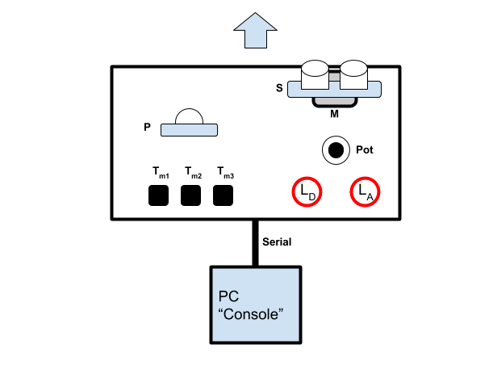

This is an embedded system implementing a smart radar for seeking and tracking objects.

It's made of a sonar S mounted on a servo-motor M that allows 0-180° rotation, a pir P,  two red leds LD e LA, 
three buttons Tm1, Tm2,Tm3, a potentiometer Pot, placed as shown:

The system is connected via serial asynchronous communication to PC, where a Java application, called "ConsoleFX" represents the other end of the system.

Features

The system has three modes : single, manual and auto. 

In single mode, the system waits for pir P to detect movement. After this event, the radar execute a full sweep, sending data to the Console. 
Sweep consists in detecting and measuring distance of objects within a 180° angle, divided in 16 slices. 
In a single sweep, the servo stops itself at each of the 16 positions - from first one to last one - and detects objects.
The speed of the sweep can be adjusted by the user from the Console or by turning the potentiometer P.  
The results will be displayed on the console. Every time an ojects is detected, led LD will be turned on.

In manual mode, the radar is driven via Console, thus the user can move it with arrow keys (left or right). 
The current position in degrees and distance of objects (if detected) will be displayed on the Console as well.

In auto mode the system constantly makes full sweeps, updating on Console every measurement.
Speed can be tuned as in single mode. 
If the radar reveal an object less than 40cm far, the system enters an alarm status, notified on Console, and with blinking of led LA. 
If in the next sweep conditions are no longer met, then the system exits alarm status.
Whenever the radar detects an object less than 20cm far, then it enters tracking mode: the sweep pause and the object distance is constantly tracked. 
As soon as the object is no longer detected within 20cm, the system exits tracking mode and goes on with the sweeping activity.

Modes (single, manual, auto) can be selected on the Console and with buttons: Tm1 selects single, Tm2 manual, Tm3 auto. 

On startup the selected mode is manual.